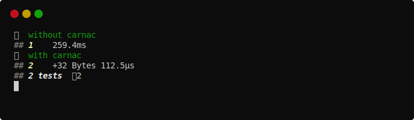

# carnac

[](https://github.com/disruptek/carnac/actions?query=workflow%3ACI)
[](https://github.com/disruptek/carnac/releases/latest)

[](#license)
[](https://www.buymeacoffee.com/disruptek)

Magical function memoization across program invocations.

## Does It Work?

No, due to a subtle compiler bug with `typed` macros. This repository is in
fact a canary with which we can monitor progress on said bug.  The original
bug surfaced in https://github.com/disruptek/cps but due to the complexity
of that code, we need a simpler reproduction such as this.

## How It Works

I mean, assuming it works, which it doesn't, this is how it works:

1. During compilation, we define a table holding the hash of inputs and
their outputs for each `func` with the `.carnac.` pragma.
1. At runtime, we attempt to load the table from a file in
`$XDG_RUNTIME_DIR/.carnac`, named according to the `func` signature.
1. We use the table as a cache for subsequent calls, updating it when necessary.
1. At program exit, we store the table to disk using `frosty` and `supersnappy`.

And, like, if you take the macro output and compile it indirectly, it _does_
work. 😉

## Demo

This example is from [the test in the tests/
subdirectory](https://github.com/disruptek/carnac/blob/master/tests/test.nim).
The program caches 1,125 bytes of data to disk.

```nim
import testes
import carnac

{.experimental: "strictFuncs".}

template test(fn: typed; x: int; r: int) =
  let y = fn(x)
  if y != r:
    raise newException(AssertionDefect, "compute")

testes:
  block:
    ## without carnac

    func fib1(x: int): int =
      case x
      of 0: 1
      of 1: 1
      else:
        fib1(x - 1) + fib1(x - 2)

    block ten:
      test fib1, 10, 89
    block forty_five:
      test fib1, 45, 1836311903

  block:
    ## with carnac

    func fib2(x: int): int {.carnac.} =
      case x
      of 0: 1
      of 1: 1
      else:
        # fib2(x - 1) + fib2(x - 2) does not work
        let q = x - 1
        let z = x - 2
        # fib2(q) + fib2(z) does not work
        let a = fib2(q) # x - 1 does not work
        let b = fib2(z) # x - 2 does not work
        a + b           # this works

    block ten:
      test fib2, 10, 89
    block forty_five:
      test fib2, 45, 1836311903
```



## Installation

```
$ nimph clone carnac
```
or if you're still using Nimble like it's 2012,
```
$ nimble install https://github.com/disruptek/carnac
```

## Documentation

[The documentation is rebuilt during the CI process and hosted on
GitHub.](https://disruptek.github.io/carnac/carnac.html)

## License
MIT
